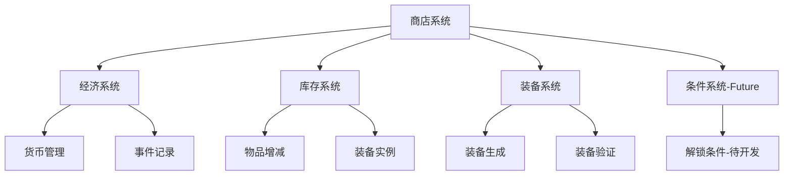
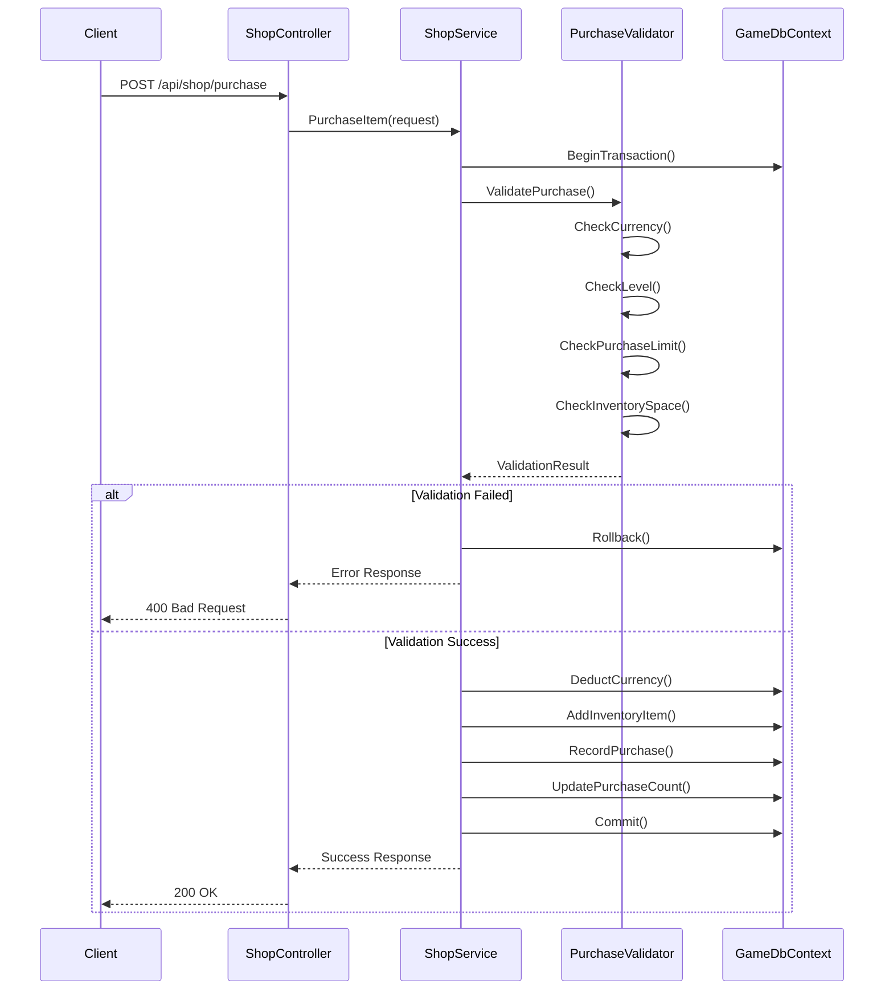
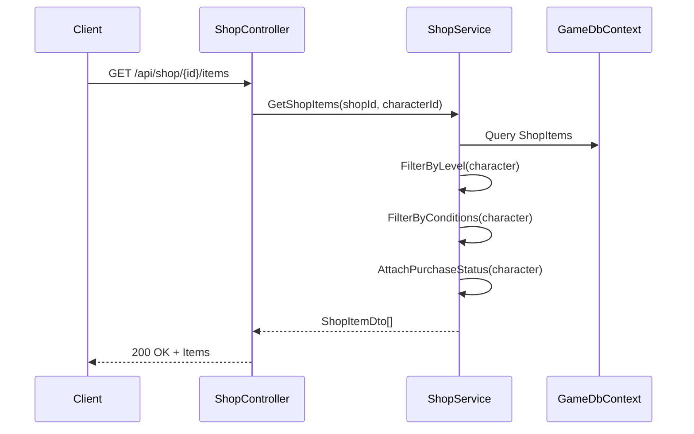

# 商店系统设计方案（上篇）- 系统分析与总体架构

**项目**: BlazorIdle  
**文档版本**: 1.0  
**创建日期**: 2025-10-12  
**状态**: 设计阶段  
**负责**: 开发团队

---

## 📋 目录

1. [执行摘要](#执行摘要)
2. [现状分析](#现状分析)
3. [设计目标](#设计目标)
4. [系统架构设计](#系统架构设计)
5. [核心概念模型](#核心概念模型)
6. [技术选型与原则](#技术选型与原则)

---

## 执行摘要

### 项目背景

基于对当前项目的整合设计总结以及装备系统的深入分析，本文档旨在为 BlazorIdle 设计一个全面、可扩展的商店系统。该系统将：

- **覆盖游戏设计中的大部分功能需求**
- **支持多种商品类型**：消耗品、食物、药剂、装备等道具
- **支持多种交易方式**：金币交易、特殊物品交易
- **为条件解锁系统预留接口**
- **维持现有代码风格和架构模式**

### 核心价值

1. **经济闭环完善**：为游戏经济系统提供重要的货币消耗渠道
2. **内容引导**：通过商店解锁引导玩家探索游戏内容
3. **玩法深度**：支持特殊交易和限时商品增加策略性
4. **可扩展性**：为未来条件解锁、声望商店等功能做好准备

### 文档结构

本设计方案分为三篇：

- **上篇（本文档）**：系统分析、总体架构、核心概念
- **中篇**：详细设计、数据模型、API设计
- **下篇**：实施方案、测试策略、交付清单

---

## 现状分析

### 2.1 已有系统回顾

#### 2.1.1 经济系统现状

**已实现功能**：

- ✅ **角色货币管理**：
  - `Character.Gold` 字段（整型）
  - `Character.Experience` 字段
  
- ✅ **经济事件记录**：
  - `EconomyEventRecord` 实体
  - 幂等性支持（IdempotencyKey）
  - 事件类型追踪（EventType）
  
- ✅ **奖励发放服务**：
  - `IRewardGrantService` 接口
  - `RewardGrantService` 实现
  - 事务支持和错误处理

**核心服务代码位置**：
```
BlazorIdle.Server/
├── Domain/Characters/Character.cs          # 角色实体（Gold字段）
├── Domain/Records/EconomyEventRecord.cs    # 经济事件记录
└── Application/Economy/RewardGrantService.cs # 奖励发放服务
```

**经济事件类型**：
```csharp
// 当前支持的事件类型（从边打边发系统）
- "periodic_reward"      // 周期性奖励
- "battle_completion"    // 战斗完成奖励
- "offline_reward"       // 离线奖励
```

#### 2.1.2 库存系统现状

**已实现功能**：

- ✅ **背包物品管理**：
  - `InventoryItem` 实体
  - 物品 ID + 角色 ID 唯一索引
  - 数量累加机制
  
- ✅ **库存 API**：
  - `GET /api/inventory/{characterId}` - 获取背包
  - 基础的增删改查支持

**数据结构**：
```csharp
public class InventoryItem
{
    public Guid Id { get; set; }
    public Guid CharacterId { get; set; }
    public string ItemId { get; set; }      // 物品定义ID
    public int Quantity { get; set; }       // 数量（可累加）
    public DateTime CreatedAt { get; set; }
    public DateTime UpdatedAt { get; set; }
}
```

**数据库表结构**：
```sql
CREATE TABLE inventory_items (
    Id TEXT PRIMARY KEY,
    CharacterId TEXT NOT NULL,
    ItemId TEXT NOT NULL,           -- 物品定义ID
    Quantity INTEGER NOT NULL,
    CreatedAt TEXT NOT NULL,
    UpdatedAt TEXT NOT NULL,
    UNIQUE(CharacterId, ItemId)     -- 每个角色每种物品唯一
);
```

#### 2.1.3 装备系统现状

**已实现功能**（Phase 1-8完成）：

- ✅ **17槽位装备系统**
- ✅ **品级系统**（T1/T2/T3）
- ✅ **词条系统**（Affix）
- ✅ **套装系统**（Set Bonus）
- ✅ **装备生成与掉落**
- ✅ **装备强化服务**

**核心实体位置**：
```
BlazorIdle.Server/Domain/Equipment/
├── Models/
│   ├── GearDefinition.cs       # 装备定义
│   ├── GearInstance.cs         # 装备实例
│   └── GearSet.cs              # 套装定义
├── Services/
│   ├── EquipmentService.cs     # 装备服务
│   └── GearGenerationService.cs # 装备生成服务
└── ValueObjects/
    └── Affix.cs                # 词条定义
```

#### 2.1.4 条件解锁系统规划

**设计需求**（来自整合设计总结）：

```csharp
// 条件表达式引擎（尚未实现）
public class ConditionExpr
{
    public string Id { get; init; }
    public string Raw { get; init; }           // DSL表达式
    public List<string> Dependencies { get; init; }
    public bool Evaluate(ConditionContext ctx);
}

// DSL 示例
"AND(level>=20, reputation.factionA>=300)"
"OR(quest.completed('Q123'), gold>=10000)"
```

**状态**：❌ 完全缺失（Phase 5 规划）

**对商店系统的影响**：
- 商店需要预留条件字段
- 支持基础的等级/金币检查
- 为未来的复杂条件做接口适配

### 2.2 系统设计原则回顾

#### 2.2.1 架构原则（整合设计总结）

1. **服务端权威**：所有交易判定在服务端
2. **数据驱动**：商品配置与代码分离
3. **事件导向**：使用 Domain Events 低耦合传播
4. **可测试性**：支持单元测试和集成测试
5. **小步演进**：分阶段实施，保持系统稳定

#### 2.2.2 代码风格规范

**命名约定**：
- 实体类：PascalCase（`ShopDefinition`, `ShopItem`）
- 服务接口：`I` 前缀（`IShopService`）
- 数据表：snake_case（`shop_definitions`, `shop_items`）
- API 路由：kebab-case（`/api/shop/buy-item`）

**文件组织**：
```
Domain/          # 领域模型
Application/     # 应用服务
Infrastructure/  # 基础设施
Api/            # API 控制器
```

**依赖注入**：
```csharp
// 在 DependencyInjection.cs 中注册
services.AddScoped<IShopService, ShopService>();
```

### 2.3 缺失功能识别

#### 2.3.1 核心缺失

| 功能 | 状态 | 优先级 |
|------|------|--------|
| 商店定义系统 | ❌ 完全缺失 | 🔴 高 |
| 商品上架机制 | ❌ 完全缺失 | 🔴 高 |
| 购买交易服务 | ❌ 完全缺失 | 🔴 高 |
| 库存扣减逻辑 | ⚠️ 部分缺失 | 🔴 高 |
| 货币扣减逻辑 | ⚠️ 部分缺失 | 🔴 高 |
| 特殊货币系统 | ❌ 完全缺失 | 🟡 中 |
| 限时商品 | ❌ 完全缺失 | 🟡 中 |
| 购买次数限制 | ❌ 完全缺失 | 🟡 中 |
| 条件解锁商店 | ❌ 完全缺失 | 🟢 低 |

#### 2.3.2 依赖分析



---

## 设计目标

### 3.1 功能目标

#### 3.1.1 核心功能（MVP）

1. **多类型商品支持**
   - ✅ 消耗品（食物、药剂）
   - ✅ 装备（武器、防具）
   - ✅ 材料（制作材料）
   - ✅ 特殊物品（任务道具、货币等）

2. **多货币交易**
   - ✅ 金币交易（主要货币）
   - ✅ 特殊货币交易（未来扩展）
   - ✅ 物品兑换（以物易物）

3. **基础限制机制**
   - ✅ 购买次数限制（日/周/永久）
   - ✅ 等级限制
   - ✅ 库存上限检查

4. **商店类型**
   - ✅ 通用商店（所有玩家可见）
   - ✅ 个人商店（角色专属）
   - ✅ 限时商店（未来扩展）

#### 3.1.2 扩展功能（Phase 2+）

5. **高级解锁条件**
   - 🔄 声望要求
   - 🔄 任务完成要求
   - 🔄 成就解锁
   - 🔄 DSL 表达式支持

6. **动态商品**
   - 🔄 随机刷新商品
   - 🔄 限时折扣
   - 🔄 库存有限商品

7. **特殊交易**
   - 🔄 拍卖行（玩家间交易）
   - 🔄 回购系统
   - 🔄 批量购买折扣

### 3.2 非功能目标

#### 3.2.1 性能目标

| 指标 | 目标值 | 说明 |
|------|--------|------|
| 商店列表查询 | < 100ms | 包含条件过滤 |
| 单次购买操作 | < 200ms | 包含验证和数据库写入 |
| 批量购买（10件） | < 500ms | 事务处理 |
| 并发购买 | 100 TPS | 同一商品限量场景 |

#### 3.2.2 可靠性目标

- **事务一致性**：100%（使用数据库事务）
- **幂等性**：支持重试机制
- **错误恢复**：回滚机制
- **日志追踪**：完整的购买历史记录

#### 3.2.3 可扩展性目标

- **商店数量**：支持 100+ 个商店定义
- **商品数量**：单个商店支持 1000+ 商品
- **条件类型**：插件化条件检查
- **货币类型**：支持 10+ 种自定义货币

### 3.3 成功标准

#### 3.3.1 开发完成标准

- [ ] 所有核心功能 API 实现
- [ ] 单元测试覆盖率 ≥ 80%
- [ ] 集成测试通过率 100%
- [ ] 性能测试达标
- [ ] 文档完整（设计+使用+API）

#### 3.3.2 质量标准

- [ ] 零已知 P0/P1 Bug
- [ ] 代码审查通过
- [ ] 安全审查通过（防刷、防注入）
- [ ] 与现有系统无冲突

---

## 系统架构设计

### 4.1 总体架构

#### 4.1.1 分层架构

```
┌─────────────────────────────────────────────────┐
│                  Presentation Layer              │
│  ┌──────────────────────────────────────────┐   │
│  │  ShopController (API Endpoints)          │   │
│  │  - GET  /api/shop/list                   │   │
│  │  - GET  /api/shop/{id}/items             │   │
│  │  - POST /api/shop/purchase                │   │
│  │  - GET  /api/shop/purchase-history        │   │
│  └──────────────────────────────────────────┘   │
└─────────────────────────────────────────────────┘
                        │
┌─────────────────────────────────────────────────┐
│               Application Layer                  │
│  ┌──────────────────────────────────────────┐   │
│  │  ShopService (业务逻辑)                  │   │
│  │  - ListShops()                           │   │
│  │  - GetShopItems()                        │   │
│  │  - PurchaseItem()                        │   │
│  │  - ValidatePurchase()                    │   │
│  └──────────────────────────────────────────┘   │
│  ┌──────────────────────────────────────────┐   │
│  │  PurchaseValidator (验证器)              │   │
│  │  - CheckCurrency()                       │   │
│  │  - CheckLevel()                          │   │
│  │  - CheckPurchaseLimit()                  │   │
│  │  - CheckInventorySpace()                 │   │
│  └──────────────────────────────────────────┘   │
└─────────────────────────────────────────────────┘
                        │
┌─────────────────────────────────────────────────┐
│                 Domain Layer                     │
│  ┌──────────────────────────────────────────┐   │
│  │  ShopDefinition (商店定义)               │   │
│  │  ShopItem (商品定义)                     │   │
│  │  PurchaseRecord (购买记录)               │   │
│  │  PurchaseLimit (限制规则)                │   │
│  └──────────────────────────────────────────┘   │
└─────────────────────────────────────────────────┘
                        │
┌─────────────────────────────────────────────────┐
│             Infrastructure Layer                 │
│  ┌──────────────────────────────────────────┐   │
│  │  GameDbContext (数据库上下文)            │   │
│  │  - DbSet<ShopDefinition>                 │   │
│  │  - DbSet<ShopItem>                       │   │
│  │  - DbSet<PurchaseRecord>                 │   │
│  └──────────────────────────────────────────┘   │
│  ┌──────────────────────────────────────────┐   │
│  │  ShopSeedData (初始数据)                 │   │
│  │  - SeedShops()                           │   │
│  │  - SeedItems()                           │   │
│  └──────────────────────────────────────────┘   │
└─────────────────────────────────────────────────┘
```

#### 4.1.2 模块依赖关系

```
ShopService
    ├── IShopService (接口)
    ├── PurchaseValidator (验证)
    ├── IRewardGrantService (货币/物品发放 - 复用)
    ├── IInventoryService (库存管理 - 新增)
    └── GameDbContext (数据访问)

PurchaseValidator
    ├── ConditionChecker (条件检查 - 未来)
    ├── LimitChecker (限制检查)
    └── Character (角色信息)
```

### 4.2 核心流程设计

#### 4.2.1 购买流程（主流程）



#### 4.2.2 查询流程



### 4.3 数据流设计

#### 4.3.1 数据流图

```
┌──────────────┐
│  玩家请求     │
│ (购买物品)    │
└──────┬───────┘
       │
       ▼
┌──────────────┐      验证阶段        ┌──────────────┐
│  商店服务     │◄────────────────────►│  验证器       │
└──────┬───────┘                      └──────────────┘
       │                                      │
       │                                      ▼
       │                              ┌──────────────┐
       │                              │ 条件检查      │
       │                              │ - 等级        │
       │                              │ - 货币        │
       │                              │ - 限制        │
       │                              └──────────────┘
       │
       ▼
┌──────────────────────────────────────────────────┐
│              事务处理                              │
│  ┌────────────┐  ┌────────────┐  ┌────────────┐  │
│  │ 扣除货币    │  │ 增加物品    │  │ 记录购买    │  │
│  └────────────┘  └────────────┘  └────────────┘  │
└──────────────────────────────────────────────────┘
       │
       ▼
┌──────────────┐
│  响应结果     │
│ - 成功/失败   │
│ - 更新后状态  │
└──────────────┘
```

---

## 核心概念模型

### 5.1 领域模型

#### 5.1.1 商店 (Shop)

**概念定义**：商店是商品的集合，代表游戏中的一个售卖点。

**核心属性**：
- **ShopId**：商店唯一标识（string）
- **ShopName**：商店名称
- **ShopType**：商店类型（通用/特殊/限时）
- **Icon**：商店图标
- **Description**：商店描述
- **UnlockCondition**：解锁条件（可选，DSL 表达式）
- **IsEnabled**：是否启用

**类型划分**：

| 商店类型 | 说明 | 示例 |
|---------|------|------|
| General | 通用商店，所有玩家可见 | 杂货铺、武器店 |
| Special | 特殊商店，需要解锁 | 黑市、声望商店 |
| Limited | 限时商店，限定时间开放 | 节日商店、周末商店 |
| Personal | 个人商店，角色专属 | VIP商店、成就商店 |

#### 5.1.2 商品 (ShopItem)

**概念定义**：商店中售卖的具体商品，关联到游戏内物品定义。

**核心属性**：
- **ItemId**：商品唯一标识（GUID）
- **ShopId**：所属商店
- **ItemType**：物品类型（Consumable/Equipment/Material/Special）
- **ItemDefinitionId**：物品定义 ID（关联到 ItemDef/GearDef）
- **DisplayName**：显示名称
- **Icon**：图标
- **Description**：描述
- **Price**：价格（货币类型 + 数量）
- **StockLimit**：库存限制（-1 为无限）
- **PurchaseLimit**：购买限制
- **RequiredLevel**：等级要求
- **UnlockCondition**：解锁条件（可选）
- **SortOrder**：排序顺序

**物品类型**：

```csharp
public enum ShopItemType
{
    Consumable,    // 消耗品（食物、药剂）
    Equipment,     // 装备（武器、防具）
    Material,      // 材料（制作材料）
    Currency,      // 货币（特殊货币）
    Special        // 特殊物品（任务道具、宠物等）
}
```

#### 5.1.3 价格 (Price)

**概念定义**：商品的售价，支持多种货币类型。

**核心属性**：
- **CurrencyType**：货币类型（Gold/SpecialCurrency/Item）
- **Amount**：数量
- **CurrencyId**：货币标识（对于特殊货币和物品）

**货币类型**：

```csharp
public enum CurrencyType
{
    Gold,              // 金币（主货币）
    SpecialCurrency,   // 特殊货币（荣誉点、竞技场币等）
    Item               // 以物易物（用物品兑换）
}
```

**价格示例**：
```json
// 金币价格
{
  "currencyType": "Gold",
  "amount": 1000
}

// 特殊货币价格
{
  "currencyType": "SpecialCurrency",
  "currencyId": "honor_points",
  "amount": 50
}

// 物品兑换价格
{
  "currencyType": "Item",
  "currencyId": "dragon_scale",
  "amount": 5
}
```

#### 5.1.4 购买限制 (PurchaseLimit)

**概念定义**：对商品购买次数的限制规则。

**核心属性**：
- **LimitType**：限制类型（None/Daily/Weekly/Total）
- **MaxPurchases**：最大购买次数
- **ResetSchedule**：重置时间（对于 Daily/Weekly）

**限制类型**：

```csharp
public enum PurchaseLimitType
{
    None,      // 无限制
    Daily,     // 每日限制
    Weekly,    // 每周限制
    Total      // 总计限制（永久）
}
```

#### 5.1.5 购买记录 (PurchaseRecord)

**概念定义**：记录角色的购买历史，用于限制检查和审计。

**核心属性**：
- **RecordId**：记录 ID（GUID）
- **CharacterId**：角色 ID
- **ShopId**：商店 ID
- **ItemId**：商品 ID
- **Quantity**：购买数量
- **Price**：实际支付价格
- **PurchasedAt**：购买时间
- **TransactionId**：事务 ID（关联 EconomyEventRecord）

### 5.2 领域关系

#### 5.2.1 实体关系图（ER图）

```
┌─────────────────┐
│  ShopDefinition │
│                 │
│ - Id            │
│ - Name          │
│ - Type          │
│ - UnlockCond    │
└────────┬────────┘
         │
         │ 1:N
         │
         ▼
┌─────────────────┐         N:1        ┌─────────────────┐
│   ShopItem      │◄───────────────────┤  Character      │
│                 │                    │                 │
│ - ItemId        │                    │ - Id            │
│ - ShopId        │                    │ - Gold          │
│ - Price         │                    │ - Level         │
│ - PurchaseLimit │                    └─────────────────┘
└────────┬────────┘                             │
         │                                      │
         │ 1:N                                  │ 1:N
         │                                      │
         ▼                                      ▼
┌─────────────────┐         N:1        ┌─────────────────┐
│ PurchaseRecord  │◄───────────────────┤  InventoryItem  │
│                 │                    │                 │
│ - RecordId      │                    │ - Id            │
│ - CharacterId   │                    │ - CharacterId   │
│ - ItemId        │                    │ - ItemId        │
│ - PurchasedAt   │                    │ - Quantity      │
└─────────────────┘                    └─────────────────┘
```

### 5.3 业务规则

#### 5.3.1 购买前验证规则

**规则优先级**（按顺序执行）：

1. **商店可用性检查**
   - 商店是否启用（IsEnabled）
   - 商店是否解锁（UnlockCondition）

2. **商品可用性检查**
   - 商品是否存在于商店
   - 商品库存是否充足（StockLimit）

3. **角色资格检查**
   - 角色等级是否满足（RequiredLevel）
   - 商品解锁条件是否满足（UnlockCondition）

4. **货币检查**
   - 金币是否充足
   - 特殊货币是否充足
   - 兑换物品是否充足

5. **购买限制检查**
   - 是否达到购买上限（Daily/Weekly/Total）
   - 库存空间是否充足

6. **并发检查**
   - 库存限制商品的并发购买控制

#### 5.3.2 购买执行规则

**原子操作**（必须在事务中执行）：

1. **扣除货币/物品**
   - 更新 `Character.Gold`
   - 或扣减 `InventoryItem.Quantity`

2. **添加商品到背包**
   - 如果已存在：累加数量
   - 如果不存在：创建新记录

3. **记录购买历史**
   - 创建 `PurchaseRecord`
   - 创建 `EconomyEventRecord`（货币变动）

4. **更新购买计数**
   - 对于有限制的商品，更新计数器

#### 5.3.3 回滚规则

**触发回滚的情况**：
- 任何验证失败
- 数据库操作失败
- 并发冲突（库存不足）

**回滚策略**：
- 数据库事务自动回滚
- 返回明确的错误信息
- 记录失败日志

---

## 技术选型与原则

### 6.1 技术栈

#### 6.1.1 后端技术

| 技术 | 版本 | 用途 |
|------|------|------|
| .NET | 8.0 | 主框架 |
| Entity Framework Core | 8.0 | ORM |
| SQLite | 3.x | 数据库 |
| ASP.NET Core | 8.0 | Web API |

#### 6.1.2 开发工具

- **IDE**: Visual Studio / Rider / VS Code
- **版本控制**: Git
- **测试框架**: xUnit
- **Mock 框架**: Moq

### 6.2 设计原则

#### 6.2.1 SOLID 原则

1. **单一职责原则（SRP）**
   - `ShopService`：商店业务逻辑
   - `PurchaseValidator`：购买验证逻辑
   - `InventoryService`：库存管理逻辑

2. **开闭原则（OCP）**
   - 条件检查器使用插件模式
   - 新增货币类型不修改现有代码

3. **里氏替换原则（LSP）**
   - `IShopService` 接口定义清晰
   - 实现可替换

4. **接口隔离原则（ISP）**
   - 细粒度接口（`IShopService`, `IPurchaseValidator`）

5. **依赖倒置原则（DIP）**
   - 依赖抽象（接口），不依赖具体实现

#### 6.2.2 DDD 原则

1. **聚合根**：`ShopDefinition`
2. **实体**：`ShopItem`, `PurchaseRecord`
3. **值对象**：`Price`, `PurchaseLimit`
4. **领域服务**：`ShopService`, `PurchaseValidator`
5. **仓储模式**：通过 `GameDbContext`

#### 6.2.3 事务管理原则

**事务边界**：
- 每次购买操作使用一个事务
- 事务范围尽可能小
- 避免长事务导致锁竞争

**示例代码**：
```csharp
using var transaction = await _context.Database.BeginTransactionAsync();
try
{
    // 扣除货币
    // 添加物品
    // 记录购买
    await _context.SaveChangesAsync();
    await transaction.CommitAsync();
}
catch
{
    await transaction.RollbackAsync();
    throw;
}
```

### 6.3 安全考虑

#### 6.3.1 防刷措施

1. **重复购买防护**
   - 使用幂等性键（IdempotencyKey）
   - 短时间内相同请求去重

2. **并发控制**
   - 乐观锁（RowVersion）
   - 悲观锁（仅限量商品）

3. **速率限制**
   - API 级别限流（每分钟最多 60 次购买请求）

#### 6.3.2 数据验证

1. **输入验证**
   - 商品 ID 合法性
   - 数量范围检查（1-999）
   - 货币数值合法性

2. **业务规则验证**
   - 服务端强制验证所有规则
   - 客户端验证仅用于 UX 优化

3. **SQL 注入防护**
   - 使用参数化查询
   - Entity Framework 自动防护

---

## 下一步

本文档（上篇）完成了系统分析与总体架构设计。接下来：

- **中篇**将详细设计数据模型、API 接口、业务逻辑
- **下篇**将制定实施方案、测试策略、交付清单

---

**文档状态**：✅ 上篇完成  
**下一文档**：商店系统设计方案（中篇）- 详细设计  
**预计完成时间**：与中、下篇同时交付
